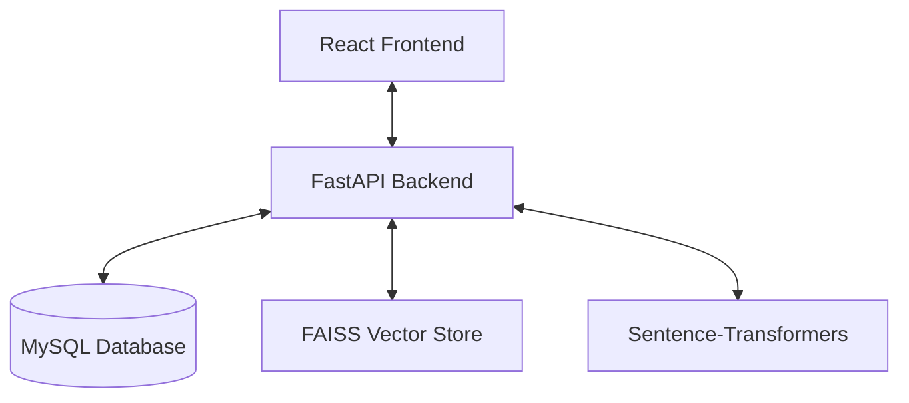

# 🏗️ System Architecture — AI-Powered Task & Knowledge Management

This document provides a high-level overview of the architectural design and technology choices for the AI-Powered Task & Knowledge Management System.

---

## 🗺️ High-Level Design

The system follows a classic **client-server decoupling** model, ensuring high scalability and maintenance ease. The application is entirely containerized using **Docker Compose**, allowing for one-command deployment.

---

## 🛠️ Stack Rationale

### 1. **Backend: FastAPI (Python 3.11)**
- **Why**: Chosen for its high performance, native support for asynchronous programming, and automatic OpenAPI (Swagger) documentation. It's ideal for CPU-bound tasks like embedding generation.
- **ORM**: **SQLAlchemy 2.0** (with PyMySQL) provides a robust and type-safe abstraction for MySQL.
- **Security**: Implements industry-standard **JWT (JSON Web Tokens)** with high-entropy hashing via `bcrypt`.

### 2. **AI / Semantic Search: local-CPU pipeline**
- **Embeddings**: `sentence-transformers` (**all-MiniLM-L6-v2**) is used for generating document and query embeddings locally on the CPU. This eliminates the need for expensive third-party APIs (like OpenAI) while maintaining high relevance.
- **Vector Search**: **FAISS** (Facebook AI Similarity Search) is utilized for lightning-fast similarity lookup. It performs locally with minimal overhead.

### 3. **Frontend: React 18**
- **Why**: Used for its component-based architecture and mature ecosystem.
- **State Management**: Uses **Context API** (AuthContext) for managing user authentication and roles globally without the overhead of Redux for an MVP-scale project.
- **Styling**: Vanilla modern CSS for custom, professional appearance.

### 4. **Infrastructure: Docker & Compose**
- **Multi-stage builds**: Optimizes container sizes for both the Python backend and the production-ready React build (served via Nginx).
- **Orchestration**: `docker-compose.yml` ensures that the MySQL healthcheck is passed before the backend starts, preventing connection race conditions.

---

## 📂 Key Components

- **`EmbeddingService`**: Handles the logic for chunking text, generating high-dimension vectors, and maintaining the FAISS index.
- **`AuthHandler`**: Implements Role-Based Access Control (RBAC) as a FastAPI dependency, ensuring strict permission checks at the route level.
- **`ActivityService`**: Automatically logs user interactions for the analytics dashboard using a non-blocking logic.

---

## 🔒 Security Measures
- **Password Hashing**: Uses `passlib` with the bcrypt algorithm.
- **Least Privilege**: RBAC ensures only Admins can upload documents or create tasks.
- **Environment Isolation**: Secrets are handled via `.env` variables and never committed to version control.
